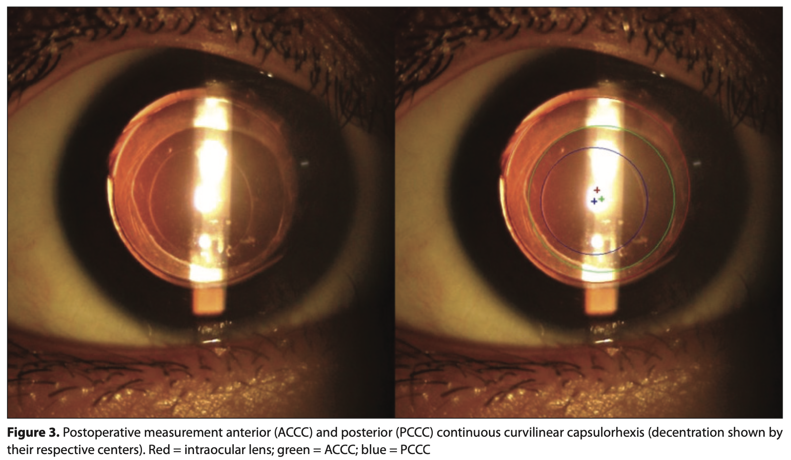

## Visual and surgical outcome of manual capsulorhexis versus 25 gauge vitrectorhexis in pediatric cataract surgery with IOL implantation.

This method compares two method of creating ACCC, PCCC and their compares how which is having better centration w.r.t that of IOL.

IOL: Intraocular Lens
ACCC: Anterior continuous curvilinear capsulorhexis
PCCC: Posterior continuous curvilinear capsulorhexis
